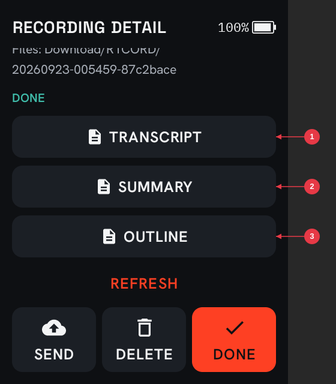
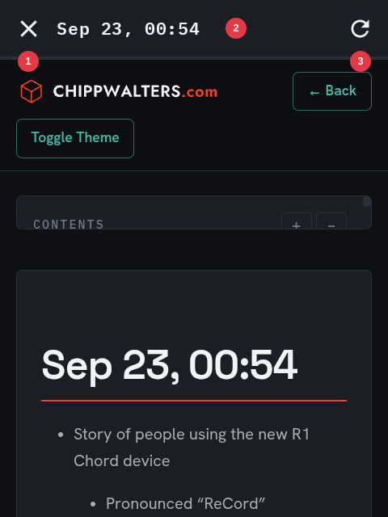
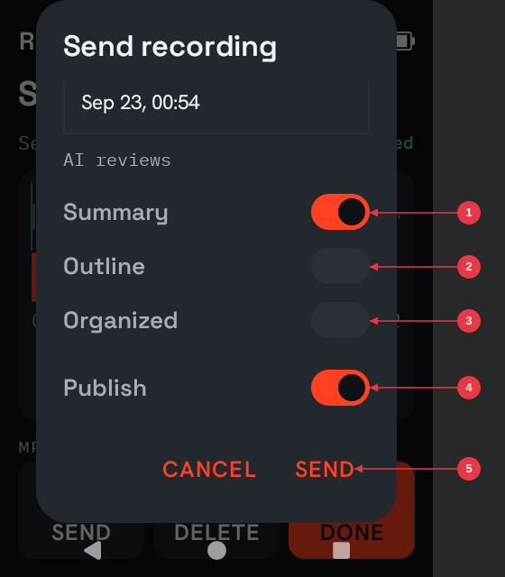
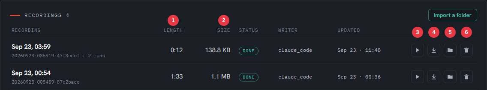

[brand-header]


# R1CORD user guide

R1CORD turns the Rabbit R1 into a pocket voice recorder. Press Start, talk, press Stop, play it back. It works with no internet, no account and no sign-in, and your recordings stay on the device until you copy them off.

You can also attach photos to a recording, and — with the optional desktop companion — have every recording transcribed automatically the moment you plug the R1 into your computer.

## Before you start: your R1 needs Android

R1CORD is an ordinary Android app. A Rabbit R1 running its factory software (rabbitOS) **cannot run it** — you first have to replace rabbitOS with Android. That is a separate, one-time job with real risk, and it is written up in its own guide:

> **[Installing Android on a Rabbit R1](Installing-Android-on-R1.md)** — read it first, all the way through, before touching the device.

Once your R1 is running Android, come back here.

## Installing R1CORD

You need two things from the [R1CORD download folder](../README.md#downloads):

| File | What it is |
|---|---|
| `R1CORD-<version>.apk` | The app, for the R1 |
| `R1CORD-Desktop-<version>-win-x64.zip` | R1CORD Desktop, the optional desktop companion, for a Windows PC (Mac and Linux coming soon) |

Want the source code as well? R1CORD is open source: **[github.com/chippwalters/r1cord-public](https://github.com/chippwalters/r1cord-public)**.

### Put the app on the R1

There is no app store on this device, so the app is installed over USB from your computer.

1. On the R1, turn on developer options and **USB debugging**: Android Settings → About phone → tap **Build number** seven times, then Settings → System → Developer options → **USB debugging**.
2. On your computer, download Google's free [Android platform-tools](https://developer.android.com/tools/releases/platform-tools) and unzip them.
3. Plug the R1 in. The R1 asks **Allow USB debugging?** — tap Allow.
4. In the platform-tools folder, run:

   ```text
   adb install R1CORD-0.3.3.apk
   ```

   It should print `Success`. If it says `INSTALL_FAILED_UPDATE_INCOMPATIBLE`, an older R1CORD is on the device that was signed differently — `adb uninstall com.chippwalters.r1cord` first. That clears the app's list of recordings, though the recording files themselves stay on the device.

5. Make R1CORD the home screen so it opens when the device starts: on the R1, open R1CORD, press the gear, choose **Home app**, and select R1CORD.

To update later, run the same command with `-r` added (`adb install -r R1CORD-<version>.apk`); your recordings and settings are kept.

### Checking your downloads (optional)

`SHA256SUMS.txt` in the download folder lists a fingerprint for each file, so you can confirm yours arrived intact. In PowerShell:

```text
Get-FileHash .\R1CORD-0.3.3.apk -Algorithm SHA256
```

Compare the result with the matching line in `SHA256SUMS.txt`; they should be identical apart from upper/lower case.

### Optional: R1CORD Desktop

R1CORD Desktop, the desktop companion, transcribes your recordings on your own PC. It is entirely optional — the recorder works without it — and nothing is sent to any cloud service. Setup is in [Using the desktop companion](#using-the-desktop-companion), near the end of this guide.

## Contents

- [The basics](#the-basics)
- [Recording](#recording)
- [Settings](#settings)
- [Playing a recording](#playing-a-recording)
- [Photos](#photos)
- [Your library](#your-library)
- [Getting recordings onto a computer](#getting-recordings-onto-a-computer)
- [Using the desktop companion](#using-the-desktop-companion)
- [Turning the R1 off, and reaching Android settings](#turning-the-r1-off-and-reaching-android-settings)
- [Where your files are](#where-your-files-are)
- [Troubleshooting](#troubleshooting)

## The basics

Turn the R1 on and R1CORD is already there — it is the device's home screen. It never starts recording on its own; that is always your decision.

The home screen has four things:

- **START RECORDING** — the big button.
- **REMAINING TIME** — roughly how much more audio fits in the space you have left.
- **LIBRARY** and **VOLUME** — your recordings, and playback loudness.
- The **gear** — settings.

## Recording

Press **START RECORDING**. While recording you see:

- the elapsed time (paused time is not counted),
- a live **MONO INPUT** level meter, so you can see the microphone is hearing you,
- **PAUSE** / **RESUME**, **PHOTO** and **STOP**.

**PAUSE** suspends the recording and **RESUME** continues the same one — you do not end up with two files. **STOP** finishes the recording and opens it, ready to play.

The screen dims after about 30 seconds while recording, so it is still readable but not wasting battery. The first touch brightens it and does what you tapped.

If the battery dies or the app is closed mid-recording, whatever was captured is kept and marked **INTERRUPTED**, so you never see a half-recording presented as a good one.

## Settings

Press the **gear** on the home screen. Settings cannot be opened while a recording is running — stop first.

**Noise cancelling** — reduces steady background noise (fans, traffic hum) while recording. Off by default. How much it helps depends on the conditions.

**Voice pausing** — records only when someone is speaking. The screen shows LISTENING while it waits and SILENCE SKIPPED when it is trimming; the quiet parts are left out of the file entirely, so a long meeting with gaps produces a much shorter recording. Choose **Quiet**, **Normal** or **Noisy** to match the room: pick Noisy in a loud place so background sound does not keep it recording, Quiet if soft speech is being missed. If you press PAUSE yourself, speech will not restart the recording — a pause stays a pause.

**Use WAV** — records uncompressed studio-quality audio instead of the normal compressed format. Files are about 7.4 times larger (roughly 346 MB per hour instead of 40 MB), so the remaining-time figure drops accordingly. Leave this off unless you specifically need it.

**Desktop server** — for the optional computer companion: the **Server URL**, **Pair** / **Unpair**, and what a recording you send gets by default: which **AI reviews** to write, and whether to **Publish** them as web pages (see [AI reviews](#ai-reviews)). The Server URL is the address your PC answers on over the internet or your Wi-Fi network; it is what **SEND** uses whenever the R1 has a working connection. Over the USB cable R1CORD finds the companion by itself, so there is nothing to set for that.

**Home app** — lets you choose a different home screen for the device.

**Power off** — see below.

Settings are read when a recording **starts**. Changing a switch during a recording affects the next one, not the one in progress.

## Playing a recording

Open **LIBRARY** and tap a recording. You get:

- a waveform with a position slider you can drag,
- **PLAY** / **PAUSE**,
- **−10** and **+10** to jump ten seconds,
- any photos you attached,
- **SEND**, **DELETE** and **DONE**,
- one button per page the desktop companion has published for it: **TRANSCRIPT**, **SUMMARY**, **OUTLINE**, **ORGANIZED**.

Each page button opens that page inside R1CORD. The **OPEN** button in the "Sent" message and the notification that follows a send open the Summary, or the first page when there is no Summary.



1. **TRANSCRIPT** — everything that was said, word for word.
2. **SUMMARY** — one of the AI reviews; only the reviews you asked for appear.
3. **OUTLINE** — another review. **ORGANIZED** appears below it when the cleaned-up version was written.

Press **REFRESH** after sending to pick up pages as the companion finishes them.



1. **Close** — back to the recording. The R1's Back gesture steps back through any links you followed first, then closes.
2. **Title** — the page's own title.
3. **Reload** — fetch the page again, for example after the companion republished it.

If the page cannot be loaded — no connection, or it is not published yet — the viewer says so and offers **RETRY**.

Nothing plays until you press PLAY — selecting a recording, or stopping one, never starts playback by itself.

To change loudness, use **VOLUME** on the home screen or the slider in the recording view. Volume starts low; whatever you set is remembered.

## Photos

Press **PHOTO** while recording, or **ADD PHOTO** on a saved recording. Frame the shot and press **Photo**. The recording keeps running the whole time, and **Back** returns to it without stopping anything. You can attach as many photos as you like; the header counts them.

Tap a thumbnail to view it full screen, with **PREVIOUS**, **NEXT**, **DELETE** and **DONE**.

Deleting a photo or a recording asks for confirmation, and only deletes it from the R1 — a copy you already made on a computer is never touched.

## Your library

Each entry shows its title, date, length and how many photos it has.

If you use the desktop companion, a status appears as well:

| Status | Meaning |
|---|---|
| *(nothing)* | On the R1 only |
| `SENDING` | Being uploaded right now |
| `PROCESSING` | Your computer has it and is working on it |
| `DONE` | Finished |
| `ERROR` | Something went wrong on the computer |

Press **REFRESH** to check for updates. R1CORD does not check in the background, so statuses change when you ask — that is deliberate, to keep the radio and the battery alone.

## Getting recordings onto a computer

Your recordings are ordinary files on the device. There are three ways to get them off, easiest first.

**1. Plug it in (with the desktop companion).** Approve the R1 once on your PC; from then on, plugging it in is all you do — the computer copies every finished recording across by itself and writes a transcript of each one. Nothing to press on the R1, no internet needed. See [Using the desktop companion](#using-the-desktop-companion).

**2. Send over Wi-Fi (with the desktop companion).** Pair the R1 with your server once in Settings, then use **SEND** on a recording, or **SEND ALL** in the library. Turn Wi-Fi on from the quick-settings shade first — R1CORD never switches the radio on or off for you. If an upload is interrupted, the next attempt picks up where it left off.

**SEND** asks what the companion should make of the recording:



1. **Summary** — a short abstract, the key points and any action items.
2. **Outline** — the topics and points in the order they came up, as a nested list.
3. **Organized** — the whole recording cleaned up: filler and false starts removed, grouped under headings, nothing left out.
4. **Publish** — put the transcript and each review on the web as pages you can open from the R1.
5. **SEND** — upload. Any combination of reviews works; with none, you get the transcript only.

**SEND ALL** uses the defaults from Settings → Desktop server.

**3. Copy the files yourself.** With Google's free Android platform-tools on your computer, and USB debugging enabled on the R1, one command copies everything:

```text
adb pull /sdcard/Download/R1CORD "C:\your\destination\folder"
```

Dragging files out of Windows Explorer is not available on this build of the device software.

Whichever way you choose: copying does **not** free up space on the R1, and the app has no way to confirm the copy worked. Check the files on your computer first, then delete the recording in R1CORD if you need the room.

## Using the desktop companion

R1CORD Desktop is the desktop companion: an app for a Windows PC. It takes recordings off the R1 and turns each one into a text transcript, using speech recognition that runs **on your own computer** — nothing is uploaded to any cloud service, and it works with the PC offline.

It is optional. The recorder is complete without it.

**Windows only, for now.** The companion currently runs on Windows. Mac and Linux versions are coming soon; until then, Mac and Linux users can still copy recordings off the R1 by hand — see option 3 in [Getting recordings onto a computer](#getting-recordings-onto-a-computer).

### Installing it

1. Unzip `R1CORD-Desktop-<version>-win-x64.zip` anywhere on your PC — your Documents folder is fine. There is no installer and no Python to set up.
2. Double-click **`R1CORD Desktop.exe`** in the unzipped folder. The app is not code-signed yet, so the first time Windows may say *Windows protected your PC*: click **More info**, then **Run anyway**.
3. The R1CORD Desktop window opens on its dashboard, and the R1CORD icon appears in the taskbar. There is no login to remember: the dashboard is only reachable from the PC itself (it is also at `http://127.0.0.1:8765/admin` in any browser on this PC).
4. Speech recognition needs a one-time download of its model, about 870 MB. It starts by itself with the first recording, or earlier from the **System** page: **Download model**. Nothing is downloaded until then.
5. For USB mode the PC also needs Google's Android tool, `adb`. If it is not already on the PC, the **Devices** page offers **Download Android platform tools** — one click, about 7 MB, straight from Google. Sending over Wi-Fi does not need it.
6. To have it start by itself, right-click the taskbar icon and choose **Start** → **At login**, or **When the R1 is plugged in**.

To remove it, choose **Quit R1CORD Desktop** from the taskbar icon and delete the unzipped folder. Your recordings and transcripts stay where they are.

**Coming from the earlier companion (r1cord-server 0.3.x)?** Quit it from its own taskbar icon (**Quit R1CORD Server**) and run the old folder's `uninstall.bat` — it removes the old start-up task and Start-menu entry and keeps your settings and recordings. Then start R1CORD Desktop as above. It uses the same settings, recordings, transcripts, pages and paired R1s, so there is nothing to move or pair again. If the old companion was using its own copy of `adb`, USB mode will ask for **Download Android platform tools** once.

### Approving your R1

With USB debugging on (the same setting used to install the app), plug the R1 in. On the admin page, open **Devices** — your R1 appears under *Connected, not adopted*. Click **Adopt**.

Nothing is ever copied from a device you have not adopted. That is what stops the companion from touching a phone or any other Android device you plug into the same PC.

### What happens after that

Every time the R1 is plugged in, the R1CORD Desktop window comes to the front and each finished recording is copied across and transcribed. Recordings still in progress are left alone until you press Stop. A recording is never processed twice, and **nothing is ever deleted from the R1** — the companion only reads.

Watch progress on the dashboard. Across the top, four tiles show whether the R1 is connected, what the companion is working on now, how many jobs are waiting, and whether everything it depends on is ready. The page refreshes itself while a job is running.

Your recordings, transcripts and a log of each job are in:

```text
C:\Users\<you>\AppData\Local\R1CORD\data
```

with each recording in its own folder: the audio, any photos, and `transcript.txt`. The **Recordings** list below the tiles has one row per recording, with its status and the writer that wrote its reviews. Click a recording's name for its job details and log. Each row also gives you its pages and its audio without digging for that folder:



1. **Pages** — Transcript, Summary, Outline and Organized, as far as they exist. A name opens the published web page; one tagged *LOCAL* is not published and opens the same page from this PC instead. The **.md** beside each name downloads its Markdown.
2. **Length** — how long the recording is.
3. **Size** — how big the recording's audio file is.
4. **Play** — plays the recording right there in the page; press it again to pause. While it plays, Length counts up.
5. **Download** — saves a copy of the audio.
6. **Folder** — opens the folder that holds it in File Explorer, in front, with the file selected.
7. **Add review** — writes a review the recording does not have yet (or rewrites one) from the stored transcript, without re-uploading anything. It is published if the recording's pages were.
8. **Delete** — removes the recording from this PC, after you confirm: the audio, transcript, reviews, published pages and job history. The copy on the R1 is untouched, and the companion will not copy it back when you plug in again. Delete and Add review are greyed out while the recording is being processed.

Folder acts on the PC itself, so it only appears when the dashboard is open on that PC. Play and Download work from anywhere you can open the dashboard.

The **System** page lists everything the companion depends on — speech recognition and its model, the AI reviews writer, USB mode, publishing, email and free disk space — each marked *OK*, *Needs attention* or *Not in use*, with a one-line detail. When the System tile at the top of the dashboard says something needs attention, click it to go there.

### AI reviews

A coding-assistant CLI signed in on the PC (Claude Code, Codex or Grok Build) can rewrite each transcript three ways, in any combination:

- **Summary** — an abstract, the key points and action items.
- **Outline** — the topics and points in the order they were discussed, as a nested list.
- **Cleaned up & organized** — everything that was said, with filler and false starts removed, grouped under headings. Nothing is summarised away.

The R1 chooses per recording on its Send sheet. Recordings copied over USB, and imported folders, use the **Default reviews** on the admin page's Settings, under **AI reviews**. With **Publish** on, the transcript and each review become web pages in the recording's publish folder. Every page links to the recording's other pages at the top and has a **Download .md** button for its Markdown.

Each review's instructions are in the same Settings section, one box per review, marked *Default* or *Custom*. Edit a box and **Save** to change what that review asks for; **Restore default** puts the original back. The companion always adds the fixed part itself — which file to write, the title, photos, the recording's date and length, and "never invent facts" — so an edit cannot break the page.

### The R1CORD icon in the taskbar

While R1CORD Desktop is running, the R1CORD logo sits in the notification area at the right-hand end of the taskbar. Hover over it for a one-line status; click it to open the R1CORD Desktop window; right-click it for its menu:

1. **R1CORD Desktop** — opens the window, like clicking the icon.
2. **Status** — whether the R1 is connected, and what the companion is doing (*Idle*, or the job it is working on).
3. **Open dashboard** — the dashboard. **Devices** and **Settings** open those pages.
4. **USB mode** and **Email finished jobs** — on/off switches; a tick means on. Email stays greyed out until an address is set on the Settings page.
5. **Open recordings folder** — and **Open logs folder** below it, for when something needs looking into.
6. **Start** — when R1CORD Desktop starts by itself: **Manual** (only when you start it), **When the R1 is plugged in**, or **At login** (it then runs in the background and restarts if it ever crashes).
7. **Quit R1CORD Desktop** — stops the companion until you start it again. Closing the window only hides it; the companion keeps working in the background.

When a job finishes, Windows shows a short notification: *Transcript ready*, the review's name (*Summary ready*), *AI reviews ready* for several, or *Job failed*.

Windows 11 hides new icons behind the **^** arrow at first. To keep R1CORD's in view, drag it from there onto the taskbar.

### Getting each review by email

If the PC has Google's `gws` command-line tool installed and signed in to your Gmail, the companion can email you each finished job: the Summary (or else the Organized version, the Outline, or the transcript), plus links to every published page. On the admin page's **Settings** page, fill in **email_to** and tick **email_enabled**; the **Email review** button on any job's page sends one by hand. Email is off until you turn it on.

### Settings worth knowing

On the admin page's **Settings** page:

- **What to do with new recordings** (`usb_auto_action`) — `transcribe` is the default. `review` also writes the default AI reviews; `publish` writes them and publishes the pages. `archive` copies files without transcribing.
- **Speech model** (`asr_model`) — the default is the most accurate one; its one-time download is about 870 MB. If transcription is too slow on your PC, choose `small` or `medium`. Speech recognition uses the PC's graphics card when it can (`asr_device` `auto`) and otherwise the processor.
- **Where recordings are kept** (`datastore`) — point this at a drive with room if you record a lot.
- **When the program runs** (`run_mode`) — the same choice as the taskbar icon's **Start** menu: `plug` starts it when the R1 is plugged in and shuts it down about ten minutes after you unplug, so nothing sits running in the background; `always` starts it at login and keeps it on — you will want that if you send over Wi-Fi from elsewhere.
- **Allow admin through the tunnel** — off by default. With it off, the dashboard answers only on this PC, even if a tunnel makes the companion reachable from outside; the R1 can still send through the tunnel. Turn it on to reach the dashboard from elsewhere; it then asks for the admin password shown on the same page.
- **Page theme** (Settings → **Pages**) — the look of the pages, from the same twelve themes as the MD DOCS app, with a live preview. A new theme applies to pages made from then on; **Republish all pages** re-makes the published ones (**Preview republish** first shows what it would change).
- **Email** (`email_enabled`, `email_to`) — see [Getting each review by email](#getting-each-review-by-email).

Two further features exist for people who have the extra pieces: **AI reviews** (needs a coding-assistant CLI installed and signed in on the PC) and **publishing** them as web pages (needs a folder your web host serves, set as `webdav_folder` and `public_url_base`; the companion makes the pages itself). Both are off unless you configure them, and neither is needed for transcripts.

### Sending over Wi-Fi instead

If you would rather not plug in, the R1 can upload over your network. On the admin page, open **Devices** and click **Generate pairing code** under *Wi-Fi pairing*; on the R1, Settings → Desktop server, enter your PC's address as the **Server URL** and the six-digit code. After that, **SEND** on any recording uploads it. This needs the PC reachable from the R1 — the same Wi-Fi network, or your own remote-access setup (a tunnel to the PC works from anywhere, as long as the PC, the companion and the tunnel are all running). With no working connection at all, SEND goes over the USB cable instead, when the R1 is plugged into the PC. A lost R1 can be locked out from the same panel: **Revoke** its key.

## Turning the R1 off, and reaching Android settings

**Power off** is in Settings. It refuses while a recording is running, so stop first. After you confirm, the device's own power menu appears and you choose Power off there.

The first time, R1CORD may ask you to enable **R1CORD power menu** in **Android Settings → Accessibility**. Android only lets an app open the power menu through that permission; R1CORD uses it for nothing else and does not read your screen.

To reach Android's own settings, swipe down from the very top of the screen to reveal the status bar, then swipe down again to open the shade, and tap the gear. Swiping up from the bottom brings back Android's navigation buttons. That shade is also where you turn Wi-Fi on and off.

## Where your files are

Every finished recording gets its own folder:

```text
Internal shared storage / Download / R1CORD / <recording ID> /
    audio.m4a          (or audio.wav if Use WAV is on)
    photo-<photo ID>.jpg
    metadata.json
```

`metadata.json` holds the title, date, length and format — useful if you process recordings on a computer. Deleting a recording in R1CORD removes the whole folder.

Nothing leaves the R1 unless you send it or copy it. R1CORD has no cloud account, no analytics and no other upload destination.

## Troubleshooting

| What you see | What to do |
|---|---|
| "No speech was captured" | Voice pausing was on and it never heard speech, so nothing was saved. Set sensitivity to **Quiet**, or turn voice pausing off. |
| Recording will not start | Storage is nearly full. Copy recordings to a computer, then delete them in the app. |
| A recording says INTERRUPTED | It was cut short — battery, or the app closing. Whatever was captured is still there. |
| "Stop recording before opening settings." | Press STOP first. Settings, sending and power off all wait for the recording to finish. |
| "No internet. Turn Wi-Fi on, or plug into the desktop with USB mode on." | Sending found no connection. Swipe down from the top and turn Wi-Fi on, or plug into the computer running the desktop server. |
| "Desktop server is not reachable (HTTP 530)…" or "…not reachable at *your server*…" | The R1 has a connection but nothing answered at your Server URL: the PC is off or asleep, the companion is not running, or your tunnel to it is down. Start them and send again — the upload picks up where it stopped. |
| "Pair with the desktop server in Settings first." | The R1 has not been paired yet. Settings → Desktop server → Pair, using the code your server shows. |
| "Not paired or token revoked. Pair again in Settings." | The server no longer recognises this R1. Pair again. |
| Status stays on PROCESSING | Your computer has not finished the job. Press REFRESH again; if it never changes, check the server on your computer. |
| Plugged in, but nothing happens | On the computer: the R1 has to be approved once on the Devices page, and USB mode needs `adb` — if the Devices page offers **Download Android platform tools**, click it. On the R1: USB debugging must be on. |
| No R1CORD icon in the taskbar | Click the **^** arrow next to the clock — Windows hides new icons there. If it is not there either, R1CORD Desktop is not running: start it from the Start menu, or double-click `R1CORD Desktop.exe` in its folder. |
| *Windows protected your PC* when starting R1CORD Desktop | The app is not code-signed yet. Click **More info**, then **Run anyway**. |
| The dashboard says *Admin unavailable* from another computer | Remote admin through a tunnel is off by default. On the PC itself, open Settings and tick **Allow admin through the tunnel**. |
| The screen dims while recording | Normal after about 30 seconds. Touch it to brighten. |
