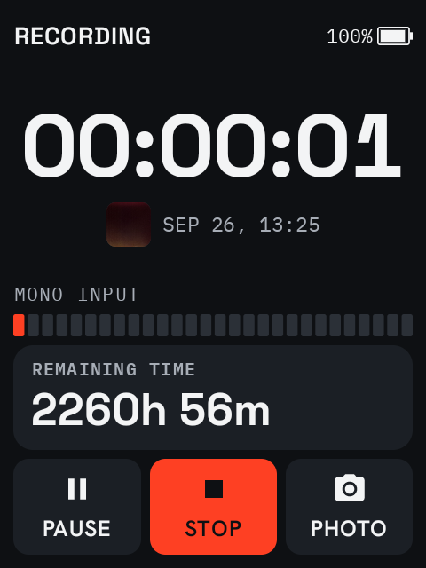
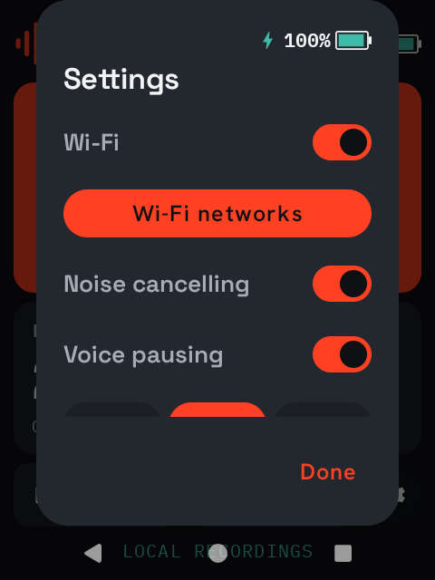
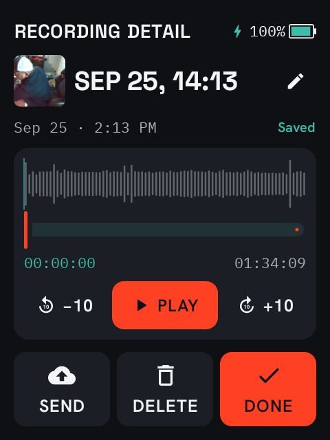
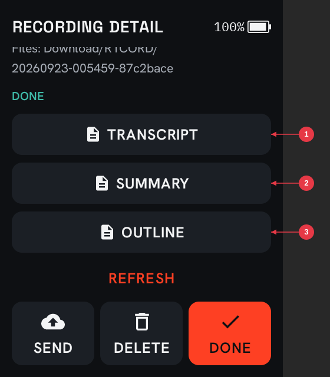
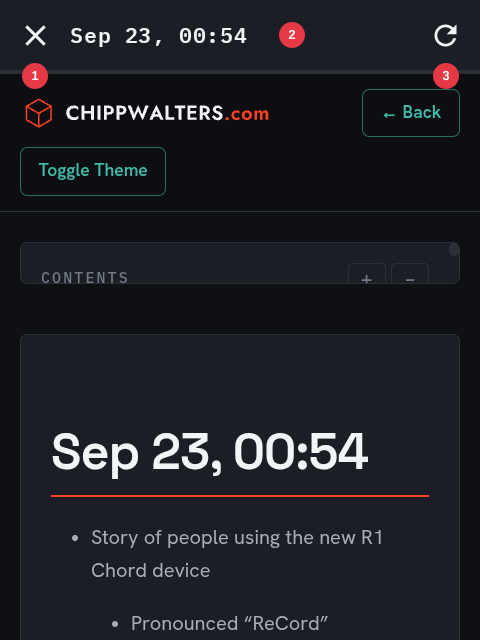
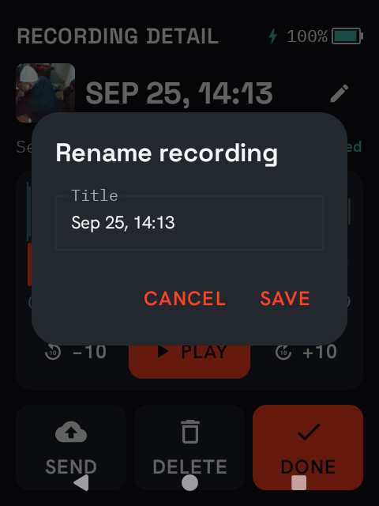
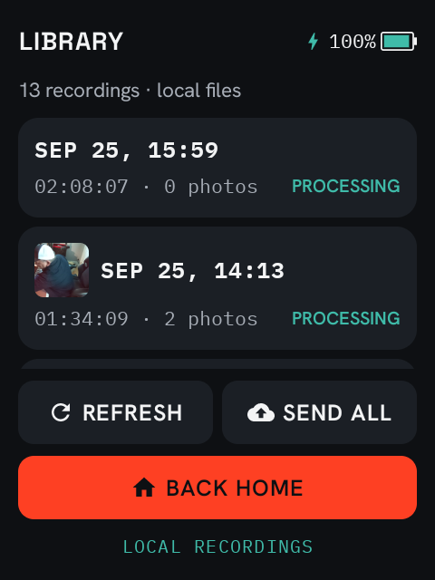
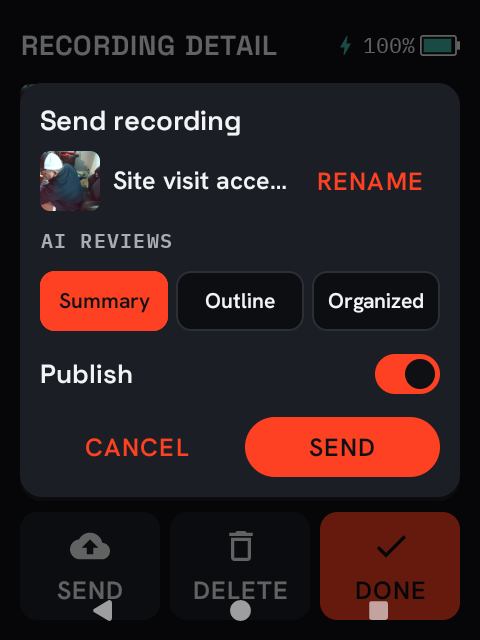
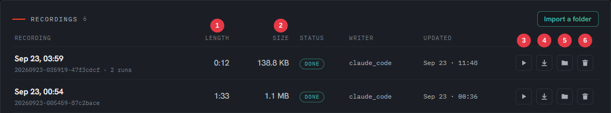

[brand-header]


# R1CORD user guide

R1CORD turns the Rabbit R1 into a pocket voice recorder. Press Start, talk, press Stop, play it back. It works with no internet, no account and no sign-in, and your recordings stay on the device until you copy them off.

You can also attach photos to a recording, and — with the optional desktop companion — have every recording transcribed automatically the moment you plug the R1 into your computer.

## Before you start: your R1 needs Android

R1CORD is an ordinary Android app. A Rabbit R1 running its factory software (rabbitOS) **cannot run it** — you first have to replace rabbitOS with Android. That is a separate, one-time job with real risk, and it is written up in its own guide:

> **[Installing Android on a Rabbit R1](Installing-Android-on-R1.md)** — read it first, all the way through, before touching the device.

Once your R1 is running Android, come back here.

## Installing R1CORD

R1CORD comes as two small Android apps plus the optional desktop companion, all in the [R1CORD download folder](../README.md#downloads):

| File | Where | What it is |
|---|---|---|
| `R1CORD-<version>.apk` | [auto-update-files](../README.md#downloads) | The app, for the R1. Take the highest version; older ones stay there in case you need to go back. |
| `R1CORD-controls-<version>.apk` | [auto-update-files](../README.md#downloads) | **R1CORD controls**, a tiny helper with no icon of its own. It lets R1CORD switch Wi-Fi and turn the R1 off directly. It only works on the Android image from the [Installing Android](Installing-Android-on-R1.md) guide. Without it R1CORD still records and sends; you use Android's own Wi-Fi panel and power menu instead. |
| `R1CORD-Desktop-<version>-win-x64.zip` | the [download folder](../README.md#downloads) itself | R1CORD Desktop, the optional desktop companion, for a Windows PC (Mac and Linux coming soon) |

Want the source code as well? R1CORD is open source: **[github.com/chippwalters/r1cord-public](https://github.com/chippwalters/r1cord-public)**.

### Put the app on the R1

There is no app store on this device, so the apps go on over USB from your computer. There are two ways:

- **With R1CORD Desktop (recommended).** Install the companion ([Installing it](#installing-it)), plug the R1 in, approve it, and press **Run setup** on the companion's **Setup** page. It installs R1CORD, R1CORD controls and Tailscale, grants their permissions, makes R1CORD the home screen and pairs the R1 with your PC in one go. See [Setting up the R1 from the desktop](#setting-up-the-r1-from-the-desktop). You still need step 1 below (USB debugging) first.
- **By hand, with Google's `adb` tool** — the steps below. Use this if you do not want the companion at all.

1. On the R1, turn on developer options and **USB debugging**: Android Settings → About phone → tap **Build number** seven times, then Settings → System → Developer options → **USB debugging**.
2. On your computer, download Google's free [Android platform-tools](https://developer.android.com/tools/releases/platform-tools) and unzip them.
3. Plug the R1 in. The R1 asks **Allow USB debugging?** — tap Allow.
4. Download [R1CORD-0.4.0.apk](../README.md#downloads) and [R1CORD-controls-1.0.0.apk](../README.md#downloads) into the platform-tools folder, then run there:

   ```text
   adb install R1CORD-0.4.0.apk
   adb install R1CORD-controls-1.0.0.apk
   ```

   Each should print `Success`. If one says `INSTALL_FAILED_UPDATE_INCOMPATIBLE`, the copy already on the R1 was signed with a different key than the file you are installing. **Stop there, and do not uninstall anything**: uninstalling R1CORD deletes its list of recordings and its pairing with your PC. Check the file's signer against the fingerprints in [Checking your downloads](#checking-your-downloads-optional); if it does not match, download it again from the folder above. If it matches and the install still refuses, get in touch before going further.

5. Make R1CORD the home screen so it opens when the device starts: on the R1, open R1CORD, press the gear, choose **Home app**, and select R1CORD.

To update later, run the same commands with `-r` added (`adb install -r R1CORD-<version>.apk`, and the same for R1CORD controls); your recordings and settings are kept. R1CORD Desktop can also do this for you over the cable — see [Keeping up to date](#keeping-up-to-date).

### Checking your downloads (optional)

Each folder has its own `SHA256SUMS.txt` listing a fingerprint for each file in it: the one in [auto-update-files](../README.md#downloads) covers the R1 apps, the one in the [download folder](../README.md#downloads) covers R1CORD Desktop. Use them to confirm your download arrived intact. In PowerShell:

```text
Get-FileHash .\R1CORD-0.4.0.apk -Algorithm SHA256
```

Compare the result with the matching line in `SHA256SUMS.txt`; they should be identical apart from upper/lower case.

To check who signed an app, use `apksigner` from Google's Android SDK build-tools: `apksigner verify --print-certs R1CORD-0.4.0.apk` prints a *certificate SHA-256 digest*, which must be exactly:

| App | Signer certificate SHA-256 |
|---|---|
| R1CORD | `4e92be8e9853f7473f5fe9ed85fde56e2a8dac1280f279b2800861cd5265b7dc` |
| R1CORD controls | `c8a2e9bccf597c2fb6dc66bee293fc13f2fc47ec77bc6b2b0d52c11f51192ab8` |
| Tailscale (installed by R1CORD Desktop) | `5cdb295551bfe1a087fed6acda07141c6c929fa7c29bd273a7092813acc434bf` |

R1CORD controls is signed with the public AOSP *platform test key* that the R1's Android image itself uses — that is what lets it switch Wi-Fi and power off, and why it works only on that image. Because that key is public, its fingerprint proves which image it fits, not who made the file: get it from the folder above (or let R1CORD Desktop fetch it, which also checks the signed release list).

### Optional: R1CORD Desktop

R1CORD Desktop, the desktop companion, transcribes your recordings on your own PC, and is also the easiest way to install and update the R1 apps. It is entirely optional — the recorder works without it — and nothing is sent to any cloud service. Setup is in [Using the desktop companion](#using-the-desktop-companion), near the end of this guide.

## Contents

- [The basics](#the-basics)
- [Recording](#recording)
- [Settings](#settings)
- [Playing a recording](#playing-a-recording)
- [Photos](#photos)
- [Your library](#your-library)
- [Getting recordings onto a computer](#getting-recordings-onto-a-computer)
- [Using the desktop companion](#using-the-desktop-companion)
- [Turning the R1 off, and reaching Android settings](#turning-the-r1-off-and-reaching-android-settings)
- [Where your files are](#where-your-files-are)
- [Troubleshooting](#troubleshooting)

## The basics

Turn the R1 on and R1CORD is already there — it is the device's home screen. It never starts recording on its own; that is always your decision.

The home screen has four things:

- **START RECORDING** — the big button.
- **REMAINING TIME** — roughly how much more audio fits in the space you have left.
- **LIBRARY** and **VOLUME** — your recordings, and playback loudness.
- The **gear** — settings.

## Recording

Press **START RECORDING**. While recording you see:

- the elapsed time (paused time is not counted),
- the recording's title, with a small thumbnail of its first photo once you have taken one,
- a live **MONO INPUT** level meter, so you can see the microphone is hearing you,
- **PAUSE** / **RESUME**, **PHOTO** and **STOP**.



**PAUSE** suspends the recording and **RESUME** continues the same one — you do not end up with two files. **STOP** finishes the recording and opens it, ready to play.

The screen dims after about 30 seconds while recording, so it is still readable but not wasting battery. The first touch brightens it and does what you tapped.

If the battery dies or the app is closed mid-recording, whatever was captured is kept and marked **INTERRUPTED**, so you never see a half-recording presented as a good one.

## Settings

Press the **gear** on the home screen. Settings cannot be opened while a recording is running — stop first.



**Wi-Fi** — switches the R1's Wi-Fi radio on and off. The switch always shows what the radio is really doing (*Turning on…*, *Turning off…*), and it refuses to turn Wi-Fi off while an upload is running — wait for the upload to finish. It works through R1CORD controls; without that helper, the switch explains why it cannot act and you use **Wi-Fi networks** instead.

**Wi-Fi networks** — opens Android's Wi-Fi panel, where you pick or join a network (and can turn Wi-Fi on or off too). Back returns to R1CORD.

**Noise cancelling** — reduces steady background noise (fans, traffic hum) while recording. Off by default. How much it helps depends on the conditions.

**Voice pausing** — records only when someone is speaking. The screen shows LISTENING while it waits and SILENCE SKIPPED when it is trimming; the quiet parts are left out of the file entirely, so a long meeting with gaps produces a much shorter recording. Choose **Quiet**, **Normal** or **Noisy** to match the room: pick Noisy in a loud place so background sound does not keep it recording, Quiet if soft speech is being missed. If you press PAUSE yourself, speech will not restart the recording — a pause stays a pause.

**Use WAV** — records uncompressed studio-quality audio instead of the normal compressed format. Files are about 7.4 times larger (roughly 346 MB per hour instead of 40 MB), so the remaining-time figure drops accordingly. Leave this off unless you specifically need it.

**Desktop server** — for the optional computer companion: the **Server URL**, **Pair** / **Unpair**, and what a recording you send gets by default: which **AI reviews** to write, and whether to **Publish** them as web pages (see [AI reviews](#ai-reviews)). The Server URL is the address your PC answers on — its private Tailscale address when the companion's **Set up R1** has run (it fills this in and pairs the R1 for you), or an address on your Wi-Fi network or your own tunnel. It is what **SEND** uses whenever that address can be reached. Over the USB cable R1CORD finds the companion by itself, so there is nothing to set for that.

**Home app** — lets you choose a different home screen for the device.

**Power off** — asks once, then turns the R1 off. Refused while a recording or upload is running. See [Turning the R1 off](#turning-the-r1-off-and-reaching-android-settings).

Settings are read when a recording **starts**. Changing a switch during a recording affects the next one, not the one in progress.

## Playing a recording

Open **LIBRARY** and tap a recording. You get:

- its title, beside a thumbnail of its first photo, and a **pencil** to rename it,
- a waveform with a position slider you can drag,
- **PLAY** / **PAUSE**,
- **−10** and **+10** to jump ten seconds,
- any photos you attached,
- **SEND**, **DELETE** and **DONE**,
- one button per page the desktop companion has published for it: **TRANSCRIPT**, **SUMMARY**, **OUTLINE**, **ORGANIZED**.



Each page button opens that page inside R1CORD. The **OPEN** button in the "Sent" message and the notification that follows a send open the Summary, or the first page when there is no Summary.



1. **TRANSCRIPT** — everything that was said, word for word.
2. **SUMMARY** — one of the AI reviews; only the reviews you asked for appear.
3. **OUTLINE** — another review. **ORGANIZED** appears below it when the cleaned-up version was written.

Press **REFRESH** after sending to pick up pages as the companion finishes them.



1. **Close** — back to the recording. The R1's Back gesture steps back through any links you followed first, then closes.
2. **Title** — the page's own title.
3. **Reload** — fetch the page again, for example after the companion republished it.

If the page cannot be loaded — no connection, or it is not published yet — the viewer says so and offers **RETRY**.

Nothing plays until you press PLAY — selecting a recording, or stopping one, never starts playback by itself.

To change loudness, use **VOLUME** on the home screen or the slider in the recording view. Volume starts low; whatever you set is remembered.

### Renaming a recording

A new recording is named after its date and time. To give it a better name, tap the **pencil** beside the title (or **RENAME** in the Send panel), type the new title and press **SAVE**. Titles can be up to 120 characters on one line.



The new title is saved on the R1 and in the recording's `metadata.json`; the folder and file names never change. A recording you already sent to the desktop companion keeps its old title there — only sends made after the rename use the new one. You cannot rename a recording while it is being recorded.

## Photos

Press **PHOTO** while recording, or **ADD PHOTO** on a saved recording. Frame the shot and press **Photo**. The recording keeps running the whole time, and **Back** returns to it without stopping anything. You can attach as many photos as you like; the header counts them.

The first photo you took becomes the recording's thumbnail, shown beside its title in the library, on the recording screen, in the recording view and in the Send panel. Delete it and the next one takes its place.

Tap a thumbnail in the photo strip to view it full screen, with **PREVIOUS**, **NEXT**, **DELETE** and **DONE**.

Deleting a photo or a recording asks for confirmation, and only deletes it from the R1 — a copy you already made on a computer is never touched.

## Your library

Each entry shows its title, date, length and how many photos it has, with a thumbnail of the first photo when it has any.



If you use the desktop companion, a status appears as well:

| Status | Meaning |
|---|---|
| *(nothing)* | On the R1 only |
| `SENDING` | Being uploaded right now |
| `PROCESSING` | Your computer has it and is working on it |
| `DONE` | Finished |
| `ERROR` | Something went wrong on the computer |

Press **REFRESH** to check for updates. R1CORD does not check in the background, so statuses change when you ask — that is deliberate, to keep the radio and the battery alone.

## Getting recordings onto a computer

Your recordings are ordinary files on the device. There are three ways to get them off, easiest first.

**1. Plug it in (with the desktop companion).** Approve the R1 once on your PC; from then on, plugging it in is all you do — the computer copies every finished recording across by itself and writes a transcript of each one. Nothing to press on the R1, no internet needed, and it works with the R1's Wi-Fi switched off. See [Using the desktop companion](#using-the-desktop-companion).

**2. Send over Wi-Fi (with the desktop companion).** Once the R1 is paired with your PC — the companion's **Set up R1** does this over your private Tailscale network, or you pair it by hand for your Wi-Fi network or your own tunnel (see [Sending over Wi-Fi instead](#sending-over-wi-fi-instead)) — use **SEND** on a recording, or **SEND ALL** in the library. Turn Wi-Fi on first with the **Wi-Fi** switch in Settings. If the R1 is plugged into the PC and the network route is not available, SEND goes over the USB cable instead. If an upload is interrupted, the next attempt picks up where it left off.

**SEND** opens the Send panel, which asks what the companion should make of the recording:



- **Title** — the recording's title, with its thumbnail. **RENAME** changes it before sending (see [Renaming a recording](#renaming-a-recording)).
- **AI REVIEWS** — three buttons in one row; tap to choose (orange means chosen), tap again to leave it out:
  - **Summary** — a short abstract, the key points and any action items.
  - **Outline** — the topics and points in the order they came up, as a nested list.
  - **Organized** — the whole recording cleaned up: filler and false starts removed, grouped under headings, nothing left out.
- **Publish** — put the transcript and each review on the web as pages you can open from the R1.
- **CANCEL** and **SEND** — always visible at the bottom of the panel. SEND uploads; any combination of reviews works, and with none you get the transcript only.

**SEND ALL** uses the defaults from Settings → Desktop server.

**3. Copy the files yourself.** With Google's free Android platform-tools on your computer, and USB debugging enabled on the R1, one command copies everything:

```text
adb pull /sdcard/Download/R1CORD "C:\your\destination\folder"
```

Dragging files out of Windows Explorer is not available on this build of the device software.

Whichever way you choose: copying does **not** free up space on the R1, and the app has no way to confirm the copy worked. Check the files on your computer first, then delete the recording in R1CORD if you need the room.

## Using the desktop companion

R1CORD Desktop is the desktop companion: an app for a Windows PC. It takes recordings off the R1 and turns each one into a text transcript, using speech recognition that runs **on your own computer** — nothing is uploaded to any cloud service, and it works with the PC offline.

It is optional. The recorder is complete without it.

**Windows only, for now.** The companion currently runs on Windows. Mac and Linux versions are coming soon; until then, Mac and Linux users can still copy recordings off the R1 by hand — see option 3 in [Getting recordings onto a computer](#getting-recordings-onto-a-computer).

### Installing it

1. Unzip `R1CORD-Desktop-<version>-win-x64.zip` anywhere on your PC — your Documents folder is fine. There is no installer and no Python to set up.
2. Double-click **`R1CORD Desktop.exe`** in the unzipped folder. The app is not code-signed yet, so the first time Windows may say *Windows protected your PC*: click **More info**, then **Run anyway**.
3. The R1CORD Desktop window opens, shows *Starting R1CORD…* while it starts, then shows its dashboard; the R1CORD icon appears in the taskbar. If it cannot start, the window says why and offers **Retry**. There is no login to remember: the dashboard is only reachable from the PC itself (it is also at `http://127.0.0.1:8765/admin` in any browser on this PC). The R1 never reaches the dashboard: over USB and Tailscale it talks to a separate port that answers only the recording API.
4. Speech recognition needs a one-time download of its model, about 870 MB. It starts by itself with the first recording, or earlier from the **System** page: **Download model**. Nothing is downloaded until then.
5. For USB mode, **Set up R1** and R1 updates, the PC also needs Google's Android tool, `adb`. If it is not already on the PC, the **Devices** page offers **Download Android platform tools** — one click, about 7 MB, straight from Google. Sending over Wi-Fi does not need it.
6. To have it start by itself, right-click the taskbar icon and choose **Start** → **At login**, or **When the R1 is plugged in**.

To remove it, choose **Quit R1CORD Desktop** from the taskbar icon and delete the unzipped folder. Your recordings and transcripts stay where they are.

**Coming from the earlier companion (r1cord-server 0.3.x)?** Quit it from its own taskbar icon (**Quit R1CORD Server**) and run the old folder's `uninstall.bat` — it removes the old start-up task and Start-menu entry and keeps your settings and recordings. Then start R1CORD Desktop as above. It uses the same settings, recordings, transcripts, pages and paired R1s, so there is nothing to move or pair again. If the old companion was using its own copy of `adb`, USB mode will ask for **Download Android platform tools** once.

### Approving your R1

With USB debugging on (the same setting used to install the app), plug the R1 in. On the admin page, open **Devices** — your R1 appears under *Connected, not adopted*. Click **Adopt**.

Nothing is ever copied from a device you have not adopted. That is what stops the companion from touching a phone or any other Android device you plug into the same PC.

### Setting up the R1 from the desktop

The **Setup** page does two jobs: it gives the R1 a private route to this PC over [Tailscale](https://tailscale.com/), so it can send from anywhere with Wi-Fi, and it installs and configures everything on the R1 over the USB cable. Open it on the PC itself; from anywhere else it only shows status. You need a Tailscale account (a *tailnet*); the PC and each R1 join it.

Everything R1CORD uses — tags, the tailnet policy, auth keys and Serve — works on Tailscale's free Personal plan; no paid feature is needed. Sign up with a personal account (Gmail, Apple or a personal GitHub) and you go straight onto that plan. Sign up with a work or custom-domain address and Tailscale treats it as business use: the tailnet starts on a 14-day trial of its paid plans and belongs to whoever controls that domain. To move to the free plan, open **Billing** in the Tailscale admin console, click **Choose a plan** and pick **Personal** — there is no separate opt-out button. The Personal plan is for non-commercial use only; see [Tailscale pricing](https://tailscale.com/pricing).

The page is one numbered list. Work down it: each step shows **Done**, **Needs you**, or **Blocked** (it waits for an earlier step, and says which), and a finished step folds to one line. Steps 1–6 are once per PC; step 7 is once per R1. Where a step sends you to the Tailscale admin console, type tag names with their `tag:` prefix, exactly as shown.

1. **Install Tailscale** — tick the box to allow it: the companion downloads the official Windows installer from pkgs.tailscale.com, checks its published SHA-256 and its Tailscale Inc. signature, and installs it after one Windows permission prompt. Done already if Tailscale is installed.
2. **Sign this PC in to Tailscale** — the button opens Tailscale's sign-in page in your browser; reload the Setup page when you are done.
3. **Share /v1 on the tailnet** — **Share /v1** makes the R1 recording API, and nothing else, reachable at the PC's private `https://….ts.net/v1` address, and only on your tailnet: nothing is published to the internet. The first time, Tailscale has to allow Serve (and its HTTPS certificates) on your tailnet: the step then shows an approval link — open it, approve, and press **Share /v1** again. **Verify from the tailnet** checks from outside that only `/v1` answers and the dashboard and its files do not. **Stop sharing /v1** turns it off again.
4. **Tailnet policy** — the whole policy in a box with a **Copy** button. In the Tailscale admin console, open **Access controls**, replace everything with it and **Save**. It lets R1s (tagged `tag:r1cord`) reach this PC (tagged `tag:r1cord-server`) on port 443 and nothing else. It is the entire policy, not a rule to add: an "allow everything" rule left beside it would still let the R1 reach your other devices. It keeps a new tailnet's default Tailscale SSH rule and Funnel setting; merge in anything else you added yourself. Saving runs the policy's own tests, and Tailscale refuses it if an R1 could reach more than this PC. The step shows **Done** once an R1 has finished setup **Ready**, because that run tests the policy from the R1.
5. **Tag this PC `tag:r1cord-server`** — admin console → **Machines** → this PC → **⋯** → **Edit ACL tags** → add `tag:r1cord-server` → **Save**. Save the policy first: it defines the tag. Tagging changes the PC's identity in Tailscale and its key expiry, so check anything else you use this PC for over Tailscale. Reload the page to see the step done.
6. **Create an auth key for the R1** — admin console → **Settings → Keys** → **Generate auth key**. The dialog has **Reusable**, **Expiration**, **Ephemeral** and **Tags**: leave Reusable off, set Expiration to 1 day, leave Ephemeral off, and turn **Tags on and pick `tag:r1cord`**. **Pre-approved** appears only when your tailnet has device approval turned on; if you see it, turn it on. Copy the key (`tskey-auth-…`). Without the tag the R1 joins as one of your own devices and can reach everything on your tailnet (see [below](#if-the-r1-joined-without-its-tag)). The step shows done when every R1 is already on the tailnet: no key needed.
7. **Set up R1** — one panel per approved R1, with the R1 plugged in:
   - Paste the key into **Tailscale auth key**. The companion types it into Tailscale on the R1 itself; it is never shown, saved or logged. Leave the box blank when this R1 is already on the tailnet, for example when you run setup again.
   - Under the key, *Apps on this PC* lists the R1CORD, controls and Tailscale versions setup will install. Only when one of them is not on this PC yet does the panel show **Download missing or newer apps from the R1CORD release server** instead. Tick it if the companion may fetch apps from the R1CORD download site — the signed release list and any APK it does not already have, including the Tailscale app (about 105 MB). Unticked, it uses only the apps bundled with R1CORD Desktop or already downloaded.
   - Tick **I replaced the tailnet policy with the R1CORD policy (no allow-all rule)** once you have done step 4. It stays ticked once an R1 has finished setup Ready.
   - Press **Run setup** (**Run setup again** after the first time) and keep the R1 plugged in. A window, *Setting up* followed by the R1's serial number, shows the run live; each step shows *Running*, then *Done*, *Skipped* or *Failed*, and a failure stops the run: check this is the Rabbit R1, this PC on the tailnet, pause recording and uploads, install R1CORD, install R1CORD controls, install Tailscale, permissions and HOME app, sign the R1 in to Tailscale, always-on VPN, pair the R1 with this PC, confirm the R1 on the tailnet, a tailnet isolation self-test, and leave maintenance. **Close** unlocks when the run ends; **Show progress** or **Show last run** on the panel opens the window again. Every app is checked against its known signer before it is installed; an existing install is updated in place, never removed. An R1CORD older than 0.4.0 cannot pause itself, so it is updated like any other app — make sure it is not recording.

The run ends **Ready.** only when every check has passed, including the `/v1` check for this PC, your policy confirmation, and an isolation test proving the R1 cannot reach another online device on your tailnet. With no other device online to test against, isolation is *inconclusive* ("isolation not proven") and setup does not claim Ready: turn on another device on your tailnet — a phone or laptop signed in to Tailscale — and run setup again with the key box blank. Until then the R1 can already send over Tailscale; only the proof is missing. **Run setup again** is safe: it redoes only what is missing.

#### If the R1 joined without its tag

If the auth key had no tag, the R1 joins your tailnet as one of your own devices, with access to everything on it. Setup notices, stops, and names the R1. To fix it: admin console → **Machines** → the R1 → **⋯** → **Edit ACL tags** → add `tag:r1cord` → **Save**, then press **Run setup again** with the key box blank. No new key is needed.

Once the R1 is Ready, **SEND** and **REFRESH** work over Tailscale from any Wi-Fi, a phone hotspot included, with no cable. The USB cable and the Wi-Fi/own-tunnel routes in [Sending over Wi-Fi instead](#sending-over-wi-fi-instead) still work as before.

### What happens after that

Every time the R1 is plugged in, the R1CORD Desktop window comes to the front and each finished recording is copied across and transcribed. Recordings still in progress are left alone until you press Stop. A recording is never processed twice, and **nothing is ever deleted from the R1** — the companion only reads your recordings. (It changes the R1 only when you run **Set up R1** or an R1 update is installed — see [Keeping up to date](#keeping-up-to-date).)

Watch progress on the dashboard. Across the top, four tiles show whether the R1 is connected, what the companion is working on now, how many jobs are waiting, and whether everything it depends on is ready. The page refreshes itself while a job is running.

Your recordings, transcripts and a log of each job are in:

```text
C:\Users\<you>\AppData\Local\R1CORD\data
```

with each recording in its own folder: the audio, any photos, and `transcript.txt`. The **Recordings** list below the tiles has one row per recording, with its status and the writer that wrote its reviews. Click a recording's name for its job details and log. Each row also gives you its pages and its audio without digging for that folder:



1. **Pages** — Transcript, Summary, Outline and Organized, as far as they exist. A name opens the published web page; one tagged *LOCAL* is not published and opens the same page from this PC instead. The **.md** beside each name downloads its Markdown.
2. **Length** — how long the recording is.
3. **Size** — how big the recording's audio file is.
4. **Play** — plays the recording right there in the page; press it again to pause. While it plays, Length counts up.
5. **Download** — saves a copy of the audio.
6. **Folder** — opens the folder that holds it in File Explorer, in front, with the file selected.
7. **Add review** — writes a review the recording does not have yet (or rewrites one) from the stored transcript, without re-uploading anything. It is published if the recording's pages were.
8. **Delete** — removes the recording from this PC, after you confirm: the audio, transcript, reviews, published pages and job history. The copy on the R1 is untouched, and the companion will not copy it back when you plug in again. Delete and Add review are greyed out while the recording is being processed.

Folder acts on the PC itself, so it only appears when the dashboard is open on that PC. Play and Download work from anywhere you can open the dashboard.

The **System** page lists everything the companion depends on — speech recognition and its model, the AI reviews writer, USB mode, publishing, email and free disk space — each marked *OK*, *Needs attention* or *Not in use*, with a one-line detail. When the System tile at the top of the dashboard says something needs attention, click it to go there.

### AI reviews

A coding-assistant CLI signed in on the PC (Claude Code, Codex or Grok Build) can rewrite each transcript three ways, in any combination:

- **Summary** — an abstract, the key points and action items.
- **Outline** — the topics and points in the order they were discussed, as a nested list.
- **Cleaned up & organized** — everything that was said, with filler and false starts removed, grouped under headings. Nothing is summarised away.

The R1 chooses per recording on its Send sheet. Recordings copied over USB, and imported folders, use the **Default reviews** on the admin page's Settings, under **AI reviews**. With **Publish** on, the transcript and each review become web pages in the recording's publish folder. Every page links to the recording's other pages at the top and has a **Download .md** button for its Markdown.

Each review's instructions are in the same Settings section, one box per review, marked *Default* or *Custom*. Edit a box and **Save** to change what that review asks for; **Restore default** puts the original back. The companion always adds the fixed part itself — which file to write, the title, photos, the recording's date and length, and "never invent facts" — so an edit cannot break the page.

### The R1CORD icon in the taskbar

While R1CORD Desktop is running, the R1CORD logo sits in the notification area at the right-hand end of the taskbar. Hover over it for a one-line status; click it to open the R1CORD Desktop window; right-click it for its menu:

1. **R1CORD Desktop** — opens the window, like clicking the icon.
2. **Status** — whether the R1 is connected, and what the companion is doing (*Idle*, or the job it is working on).
3. **Open dashboard** — the dashboard. **Devices** and **Settings** open those pages.
4. **USB mode** and **Email finished jobs** — on/off switches; a tick means on. Email stays greyed out until an address is set on the Settings page.
5. **Open recordings folder** — and **Open logs folder** below it, for when something needs looking into.
6. **Start** — when R1CORD Desktop starts by itself: **Manual** (only when you start it), **When the R1 is plugged in**, or **At login** (it then runs in the background and restarts if it ever crashes).
7. **Quit R1CORD Desktop** — stops the companion until you start it again. Closing the window only hides it; the companion keeps working in the background.

When a job finishes, Windows shows a short notification: *Transcript ready*, the review's name (*Summary ready*), *AI reviews ready* for several, or *Job failed*.

Windows 11 hides new icons behind the **^** arrow at first. To keep R1CORD's in view, drag it from there onto the taskbar.

### Getting each review by email

If the PC has Google's `gws` command-line tool installed and signed in to your Gmail, the companion can email you each finished job: the Summary (or else the Organized version, the Outline, or the transcript), plus links to every published page. On the admin page's **Settings** page, fill in **email_to** and tick **email_enabled**; the **Email review** button on any job's page sends one by hand. Email is off until you turn it on.

### Settings worth knowing

On the admin page's **Settings** page:

- **What to do with new recordings** (`usb_auto_action`) — `transcribe` is the default. `review` also writes the default AI reviews; `publish` writes them and publishes the pages. `archive` copies files without transcribing.
- **Speech model** (`asr_model`) — the default is the most accurate one; its one-time download is about 870 MB. If transcription is too slow on your PC, choose `small` or `medium`. Speech recognition uses the PC's graphics card when it can (`asr_device` `auto`) and otherwise the processor.
- **Where recordings are kept** (`datastore`) — point this at a drive with room if you record a lot.
- **When the program runs** (`run_mode`) — the same choice as the taskbar icon's **Start** menu: `plug` starts it when the R1 is plugged in and shuts it down about ten minutes after you unplug, so nothing sits running in the background; `always` starts it at login and keeps it on — you will want that if you send over Wi-Fi from elsewhere.
- **R1 API port** (`api_port`, default 8766) — the separate port the R1 talks to over the USB cable and Tailscale. It answers only the recording API, never the dashboard, and must differ from `listen_port`.
- **Allow admin through the tunnel** — off by default. With it off, the dashboard answers only on this PC, even if a tunnel of your own makes the companion reachable from outside; the R1 can still send. Turn it on to reach the dashboard from elsewhere; it then asks for the admin password shown on the same page. It never opens the dashboard to the R1, and Tailscale sharing from the Setup page carries only the R1 API either way.
- **Page theme** (Settings → **Pages**) — the look of the pages, from the same twelve themes as the MD DOCS app, with a live preview. A new theme applies to pages made from then on; **Republish all pages** re-makes the published ones (**Preview republish** first shows what it would change).
- **Email** (`email_enabled`, `email_to`) — see [Getting each review by email](#getting-each-review-by-email).

Two further features exist for people who have the extra pieces: **AI reviews** (needs a coding-assistant CLI installed and signed in on the PC) and **publishing** them as web pages (needs a folder your web host serves, set as `webdav_folder` and `public_url_base`; the companion makes the pages itself). Both are off unless you configure them, and neither is needed for transcripts.

### Keeping up to date

R1CORD Desktop contacts the release server only if you let it. The first time, a banner asks **Check for updates?** — **Yes, check daily**, **No thanks**, or **More options**. A check downloads a small signed release list from the R1CORD download site; it sends nothing about you or your recordings.

The **Updates** page holds the same choices:

- **Check for updates once a day** — on or off. **Check now** fetches the release list once, even when daily checks are off.
- **R1 app updates** — **Off** (never offer R1 updates), **Ask** (show them on this page and install only when you press **Install**; the default), or **Install** (install verified updates by themselves when the R1 is plugged in and idle).
- **Latest release** — when the list was last checked, and the versions of R1CORD Desktop, R1CORD, R1CORD controls and Tailscale it names.

R1 updates are installed only over the USB cable, never while the R1 is recording or uploading, and never by uninstalling first, so recordings, settings and pairing are kept. (An R1CORD older than 0.4.0 cannot pause itself, so it is updated without that pause — make sure it is not recording.) A release list that is not signed by R1CORD's publication key, or is older than one already accepted, is refused, and so is any app not signed by its known signer (see [Checking your downloads](#checking-your-downloads-optional)). Desktop updates never install themselves: the page links the new zip — quit R1CORD Desktop and unzip it over the old folder.

### Sending over Wi-Fi instead

If you would rather not plug in, the R1 can upload over the network. The recommended route is Tailscale, set up for you by [Setting up the R1 from the desktop](#setting-up-the-r1-from-the-desktop): it works from anywhere the R1 has Wi-Fi, and only the recording API is shared, only with your R1s.

You can also pair by hand, for a PC on the same Wi-Fi network or your own remote-access setup (a tunnel to the PC works from anywhere, as long as the PC, the companion and the tunnel are all running). On the admin page, open **Devices** and click **Generate pairing code** under *Wi-Fi pairing*; on the R1, Settings → Desktop server, enter your PC's address as the **Server URL** and the six-digit code. After five wrong codes the code stops working; generate a new one.

Either way, **SEND** on any recording then uploads it once Wi-Fi is on. When the network route is not available and the R1 is plugged into the PC, SEND goes over the USB cable instead — that works with the R1's Wi-Fi off. A lost R1 can be locked out from the Devices page: **Revoke** its key.

## Turning the R1 off, and reaching Android settings

**Power off** is in Settings. It refuses while a recording or an upload is running, or while the desktop is setting the R1 up — finish first. It asks once (**Power off R1?**); confirm and the R1 turns itself off. It does this through R1CORD controls.

Turning the R1 back **on** always needs its power button: no app can switch on a device that is fully off.

If R1CORD controls is not installed, or reports that it cannot power off, R1CORD says so and falls back to Android's own power menu (**Open Android power menu**), where you choose Power off. For that, R1CORD may first ask you to enable **R1CORD power menu** in **Android Settings → Accessibility**. Android only lets an app open the power menu through that permission; R1CORD uses it for nothing else and does not read your screen. With R1CORD controls working you do not need it.

To reach Android's own settings, swipe down from the very top of the screen to reveal the status bar, then swipe down again to open the shade, and tap the gear. Swiping up from the bottom brings back Android's navigation buttons. The shade has a Wi-Fi tile as well, though the **Wi-Fi** switch and **Wi-Fi networks** in R1CORD's Settings are quicker.

## Where your files are

Every finished recording gets its own folder:

```text
Internal shared storage / Download / R1CORD / <recording ID> /
    audio.m4a          (or audio.wav if Use WAV is on)
    photo-<photo ID>.jpg
    metadata.json
```

`metadata.json` holds the title, date, length and format — useful if you process recordings on a computer. Renaming a recording updates the title in it; the folder and file names stay the same. Deleting a recording in R1CORD removes the whole folder.

Nothing leaves the R1 unless you send it or copy it. R1CORD has no cloud account, no analytics and no other upload destination.

## Troubleshooting

| What you see | What to do |
|---|---|
| "No speech was captured" | Voice pausing was on and it never heard speech, so nothing was saved. Set sensitivity to **Quiet**, or turn voice pausing off. |
| Recording will not start | Storage is nearly full. Copy recordings to a computer, then delete them in the app. With an older R1CORD (0.3.3 or earlier), "Recording failed: Volume external_primary not found" after a restart means the app started before the device's storage was ready: install 0.3.4 or later, which recovers by itself. |
| A recording says INTERRUPTED | It was cut short — battery, or the app closing. Whatever was captured is still there. |
| "Stop recording before opening settings." | Press STOP first. Settings, renaming, sending and power off all wait for the recording to finish. |
| "Device maintenance in progress. Try again shortly." | R1CORD Desktop is setting up or updating the R1 over the cable. Wait for it to finish (the Setup or Updates page shows progress), then try again. |
| "No internet. Turn Wi-Fi on, or plug into the desktop with USB mode on." | Sending found no connection. Turn on the **Wi-Fi** switch in Settings (use **Wi-Fi networks** to join a network), or plug into the computer running the desktop server — the cable works with Wi-Fi off. |
| "Tailscale is off on this R1…" | Your Server URL is a Tailscale address, but Tailscale on the R1 is not connected — usually because Wi-Fi is off. Turn Wi-Fi on in Settings, or plug into the desktop. If it persists with Wi-Fi on, run **Set up R1** on the desktop's Setup page again. |
| "Desktop server is not reachable (HTTP 530)…" or "…not reachable at *your server*…" | The R1 has a connection but nothing answered at your Server URL: the PC is off or asleep, the companion is not running, or the route to it is down — Tailscale on the PC (check the Setup page shows *Connected* and `/v1` shared) or your own tunnel. Start them and send again — the upload picks up where it stopped. |
| "Pair with the desktop server in Settings first." | The R1 has not been paired yet. Settings → Desktop server → Pair, using the code your server shows. |
| "Not paired or token revoked. Pair again in Settings." | The server no longer recognises this R1. Pair again, or run **Set up R1** on the desktop's Setup page. |
| "…too many wrong pairing codes; create a new code on the desktop" | Five wrong codes lock a pairing code. Click **Generate pairing code** on the Devices page again and use the new one. |
| The **Wi-Fi** switch or **Power off** says "R1CORD controls is not installed" (or *is not responding*, *has an unexpected signature*) | The helper is missing or is not the released one. Install `R1CORD-controls-<version>.apk` (see [Put the app on the R1](#put-the-app-on-the-r1)) or run **Set up R1**. Until then use **Wi-Fi networks**, and Power off opens Android's power menu instead. |
| `INSTALL_FAILED_UPDATE_INCOMPATIBLE` when installing | The app on the R1 and the file were signed with different keys. Do **not** uninstall — that erases R1CORD's recording list and pairing. Check the file's signer against [Checking your downloads](#checking-your-downloads-optional), download it again, and get in touch if a genuine file still refuses. Set up R1 stops at the same point for the same reason. |
| The R1 is off and will not turn on from the app | Nothing can switch on a device that is fully off. Press the R1's power button. |
| The Setup page says *Not ready* or *isolation not proven* | The reason is shown in the run window (**Show last run**) and on the failed step. *Isolation not proven* (*inconclusive*) means no other device on your tailnet was online to test against — turn another tailnet device on and run setup again with the key box blank. Also check you replaced (not added to) the tailnet policy and ticked its box. |
| Set up R1 stops: "The R1 joined your tailnet WITHOUT tag:r1cord…" | The auth key had no tag, so the R1 joined as your own device. Follow the message: admin console → **Machines** → the R1 → **Edit ACL tags** → add `tag:r1cord`, then **Run setup again** with the key box blank. Next time turn **Tags** on when you create the key. |
| **Share /v1** says Serve is not enabled on your tailnet yet | Tailscale needs your approval the first time. Open the link it shows, approve, then press **Share /v1** again. |
| R1CORD Desktop says *R1CORD could not start.* instead of *Starting R1CORD…* | The window shows the reason underneath. Press **Retry**; if it says it is trying again by itself, wait for that. |
| Status stays on PROCESSING | Your computer has not finished the job. Press REFRESH again; if it never changes, check the server on your computer. |
| Plugged in, but nothing happens | On the computer: the R1 has to be approved once on the Devices page, and USB mode needs `adb` — if the Devices page offers **Download Android platform tools**, click it. On the R1: USB debugging must be on. |
| No R1CORD icon in the taskbar | Click the **^** arrow next to the clock — Windows hides new icons there. If it is not there either, R1CORD Desktop is not running: start it from the Start menu, or double-click `R1CORD Desktop.exe` in its folder. |
| *Windows protected your PC* when starting R1CORD Desktop | The app is not code-signed yet. Click **More info**, then **Run anyway**. |
| The dashboard says *Admin unavailable* from another computer | Remote admin through a tunnel is off by default. On the PC itself, open Settings and tick **Allow admin through the tunnel**. (Tailscale sharing from the Setup page never includes the dashboard.) |
| *This device isn't Play Protect certified* keeps appearing, with a sound | It comes from Google Play Services on the Android install, not from R1CORD, which uses no Google services. Register the device at <https://www.google.com/android/uncertified>, or stop Play Services posting notifications — from the computer: `adb shell pm revoke com.google.android.gms android.permission.POST_NOTIFICATIONS`, then `adb shell pm set-permission-flags com.google.android.gms android.permission.POST_NOTIFICATIONS user-set user-fixed`. |
| The screen dims while recording | Normal after about 30 seconds. Touch it to brighten. |
